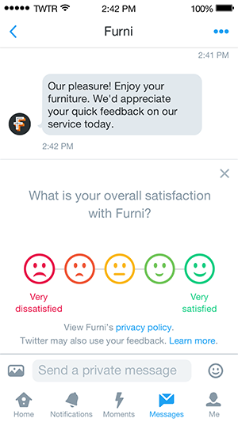
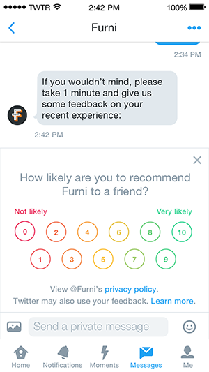

======================================
Feedback API
======================================
**CURRENT STATUS: Beta**

Collecting structured feedback about customer interactions is an important part of the customer service experience, providing quantitative measures of service quality and effectiveness that benefits both users and businesses. Existing approaches on Twitter involving links to surveys or entry of unstructured text in DMs or Tweets add friction, resulting in lower engagement.

Twitter now supports the programmatic creation and delivery of feedback prompts that allow a user to submit responses to feedback surveys after a conversation.

For API access please contact your Twitter account manager.

API Reference
-----------------------------
- `POST feedback/create.json </feedback/create.rst>`_
- `GET feedback/show/:id.json </feedback/show.rst>`_
- `GET feedback/events.json </feedback/events.rst>`_
- `Webhooks </webhooks.rst>`_

Feedback Product Guidance
-----------------------------
- Feedback should ideally be built into your product so it can be kicked off automatically, not manually. The goal being to remove potential bias in results and to give a sense of trust to the user (for more honest feedback) that the agent who handled the interaction is not reading the results.

- Feedback results should be delivered to the business via your product. We've built our APIs with an assumption that you could create a dashboard or file download to provide reports to managers. Twitter is not planning to provide an interface for businesses to retrieve results directly from Twitter.

- We’ve heard from many brands that a CSV export functionality is highly desired. Feedback data can be passed to customers without any special limitations or requirements so you can build robust export / API functionality for your customers.

- Feedback results should ideally not be surfaced directly to an agent, and instead be surfaced in supervisor reports or in an asynchronous way such that an agent doesn’t see the feedback and change their interaction demeanor or behavior.

- Consider building in some mechanism to prevent a user from getting spammed with feedback requests. There may be people who interact frequently with brands, and it could be frustrating to feel inundated with requests for feedback. Our guidance would be to throttle feedback requests to once per week from a business to a user.

- Initially Feedback can only be requested along with a Direct Message. Make sure to check the user object can_dm to see if you have the ability to send Feedback before hitting the POST endpoint. (Particularly relevant if sending a Feedback prompt after a public interaction.)

- A DM must be sent before prompting a user for Feedback.When brands are considering the DM message text preceding the Feedback prompt, make sure it makes sense in the case that the Feedback experience never renders (old clients, 3rd party clients, etc).

- Scores and text can be submitted independently and will likely have different timestamps. A score may be submitted without a text comment ever being completed. Both scores and text are immutable once submitted.

- Code should be tolerant of n ­ number of updates per Feedback object. It should not assume a max of three possible updates. You should always rely on the most recent “updated_at” timestamp.

- An empty next_cursor value indicates you have reached the end of the result set. You should make no assumption about empty / partial page returned in "events" array as a signal that there is no more data to be fetched.

Access & Authentication
-----------------------------
- For testing we have a param "test":boolean that should be used on all requests

- We must whitelist all webhook URLs manually. Please send basic auth creds in a secure format (e.g. JPG file) and the URL we should post to.

- Your client app ID and a @username must each be whitelisted to get app­level access to the API.

- Separate development accounts are also recommended to test publishing and receiving feedback requests and responses.

- Authentication is 3­legged OAuth currently used with the Twitter public API.

- We must additionally whitelist the @username for any accounts you wish to send Feedback requests FROM (either your customer’s handles or your own if used for testing purposes).

- These endpoints are hosted on the api.twitter.com domain.